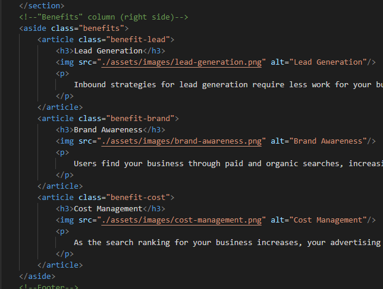

# code-refactor for Horiseon webpage

## Description 

This is a code refactor of Horiseon Social Solutions. The source code previously did not include semantic HTML Elements to meet accessibility stantdards. By doing so allows for others to look at and more clearly understand how the webpage elements are organized and displayed. The source code was previously not the easiest to follow or organize. It should now be easier to read and follow than before. All the changes were completed without compromising the functionality or view of the webpage.

[Deployed Website](https://maverickwong17.github.io/code-refactor/)

---

## Installation

To install this project, fork repository to your github account.
When repository is on your own github, clone to your own machine.

## Usage 

Demonstrate edits to a webpage to meet accessibility standards.

    Picture of updated source code below.

## Credits

[w3 Schools](https://www.w3schools.com/)

## License

MIT License

---